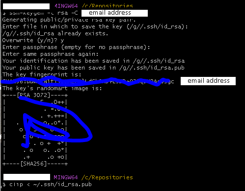

# Steps to get started with Gitbash
After you have downloaded Gitbash, it is best to configure your environment. This will include setting up your username and email address, configuring your ssh key, setting up your proxy, and more. 

## Username and email address

First you can set your global user name. This does not have to be your name, it can be a nickname or joke name. Open Git Bash and run the command below, using the username of your choice. 

`git config --global user.name "Mona Lisa"`

Confirm the username.

`git config --global user.name`

Also set up your email address. Run the command below in Git Bash. 

`git config --global user.email "YOUR_EMAIL"`

Confirm your email address.  

`git config --global user.email`

## Set up your SSH Key

The Secure Shell Protocol (SSH) key is valuable since it eliminates manual password authentication. This make pushing to a repository much smoother. First create an SSH key and then navigate to github.com to add it within your Settings.

`ssh-keygen -t rsa -C "youremail"`

After hitting enter on your keyboard, Gitbash will prompt you for where to save the file and to provide a passphrass. It's ok to skip through these requests by hitting enter on your keyboard until the key's fingerprint and image are displayed. After that, copy, or clip, the SSH key with the command below.

`clip < ~/.ssh/id_rsa.pub`

Open and log into [github.com](https://www.github.com). Click your icon in the top right corner, click Settings, then click SSH and GPG keys.  

Click New SSH key and paste your key, then give it a name. Finally click Add SSH key and Github should confirm it has been added.

### Here are the steps to add files to be ignored by git

`cd .git`  

`nano .gitignore`  

Then add the file names to the .gitignore in a text editor  

### Python command from Git Bash command line

`alias python='winpty python.exe'`
